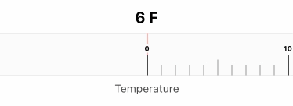
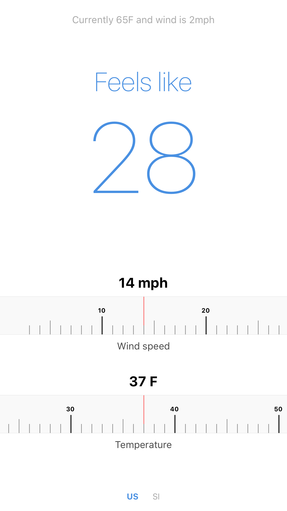

# react-native-line-gauge

A sliding linear gauge (or rule) to pick values easily



Note: This component is only the slide-y bits in the center. You'll want to add your own label and value components.

## Install

    npm install -S react-native-line-gauge

## Usage

```javascript
<LineGauge min={0} max={100} onChange={this._handleGaugeChange} />
```

## Props

Prop | Default | Description
-----|---------|------------
min | 1 | minimum value to render
max | 100 | maximum value to render
largeInterval | 10 | makes a long tick every `largeInterval`
mediumInterval | 5 | makes a medium tick every `mediumInterval`
initialValue | | sets the scroll offset to match this value on initial render
onChange | `noop` | returns current value on scroll

## API

Method | Description
-------|------------
`value(number)`| Translates value to scroll position. Call using ref

## Showcase

Used in the following apps:

### Windchill

[App Store]()



## License

ISC, copyright Nic Haynes
